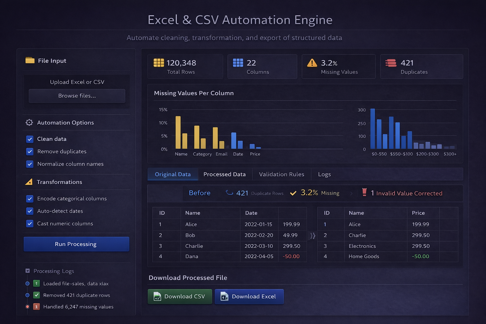

# CSV Automation Engine



A Streamlit-based application for interactively cleaning, transforming, visualizing, and exporting CSV datasets with pandas and scikit-learn.

The application provides a browser-based interface where a CSV file can be uploaded, inspected, processed with selectable automation operations, visualized, and downloaded as a processed CSV.

## Features

The current application implements the following operations:

### Data inspection

After uploading a CSV file, the application displays:

- Total number of rows
- Total number of columns
- Number of rows containing missing values
- Number of duplicate rows
- A dataframe preview of the uploaded data

### Data cleaning

Optional cleaning operations include:

- Remove rows containing missing values
- Remove duplicate rows
- Convert negative numeric values to their absolute values

### Transformations

Optional transformations include:

- Normalize numeric columns
- Encode categorical/object columns with integer labels
- Replace missing numeric values with the numeric column mean

### Visualization

The application provides selectable visualizations using Streamlit:

- Line chart
- Bar chart
- Area chart
- Scatter chart
- Map

The user selects an X-axis column, a Y-axis column, and a chart type.

### Export

After processing, the resulting dataframe can be downloaded as a CSV file.

Downloaded files use the following naming pattern:

```text
processed_<original_filename>.csv
```

---

## How it works

The application is organized around three processing components:

```text
CSV file
   │
   ▼
Streamlit upload
   │
   ▼
pandas DataFrame
   │
   ├── Data inspection
   │
   ├── Cleaning
   │     ├── Remove missing rows
   │     ├── Remove duplicates
   │     └── Absolute negative numeric values
   │
   ├── Transformations
   │     ├── Mean imputation
   │     ├── Numeric normalization
   │     └── Categorical label encoding
   │
   ├── Visualization
   │
   ▼
Processed DataFrame
   │
   ▼
CSV download
```

The UI is implemented in `app.py`, while reusable data-processing operations are located in the `processing/` package.

---

## Project structure

```text
CSV_Automation_Engine/
├── app.py
├── requirements.txt
├── Dockerfile
├── .dockerignore
├── tests.py
├── processing/
│   ├── __init__.py
│   ├── loader.py
│   ├── cleaner.py
│   └── transformations.py
├── Uploads/
│   ├── alzheimers_disease_data.csv
│   ├── all-rockets-from-1957.csv
│   ├── Nike_Sales_Uncleaned.csv
│   └── bank.csv
├── garbages/
└── final_commit.png
```

### Main files

#### `app.py`

The Streamlit application and user interface.

It handles:

- CSV upload
- UI controls
- dataset summary
- dataframe previews
- processing tabs
- visualizations
- CSV download

The main application class is:

```python
Automator
```

The processing interface is divided into four tabs:

```text
Data Cleaning
Transformations
Visualisation
Final Data
```

#### `processing/cleaner.py`

Contains the `Cleaner` class.

Implemented methods:

```python
remove_na()
get_na_rows()
get_percentage_missing()
remove_duplicates()
get_duplicate_rows()
get_negative_rows()
get_absolutes()
```

#### `processing/transformations.py`

Contains the `Transformations` class.

Implemented methods:

```python
get_numerical_cols()
get_categorical_cols()
normalize()
encode_categorical()
replace_na_mean()
```

#### `processing/loader.py`

Contains the `Logs` class, which currently provides basic dataframe dimensions:

```python
total_rows_cols()
```

#### `tests.py`

This is currently a simple Streamlit/matplotlib plotting experiment using `Uploads/bank.csv`. It is not a comprehensive automated test suite.

---

# Requirements

The pinned Python dependencies are:

```text
pandas==2.3.3
streamlit==1.63.0
numpy==2.3.5
scikit-learn==1.9.0
```

A Python environment capable of installing these package versions is required.

---

# Installation

Clone or copy the repository:

```bash
git clone <repository-url>
cd CSV_Automation_Engine
```

Create a virtual environment:

```bash
python -m venv .venv
```

Activate it on Linux/macOS:

```bash
source .venv/bin/activate
```

Install the dependencies:

```bash
pip install -r requirements.txt
```

---

# Running the application

Start Streamlit with:

```bash
streamlit run app.py
```

Streamlit will start a local web application and display the address in the terminal.

Open the displayed local URL in a web browser.

---

# Using the application

## 1. Upload a CSV

Use the **File Input** section in the sidebar and select a `.csv` file.

The application saves the uploaded file under:

```text
Uploads/
```

and loads it into a pandas DataFrame.

## 2. Inspect the dataset

The application displays summary information including:

- row count
- column count
- rows containing missing values
- duplicate rows

A dataframe preview is also displayed.

## 3. Select cleaning operations

The sidebar provides these options:

```text
Remove missing values
Remove Duplicates
Absolute negative numbers
```

These operations are applied by the `Cleaner` class.

## 4. Select transformations

The available transformation options are:

```text
Normalize column names
Encode Categorical columns
Replace missing values with Mean
```

The current implementation's `normalize` option performs **numeric value normalization** using scikit-learn's `Normalizer`; it does not rename or normalize column names.

## 5. Visualize the dataset

The Visualisation tab allows selection of:

- X-axis column
- Y-axis column
- chart type

Available chart types are:

```text
Line
Bar
Area
Scatter
Map
```

## 6. Review final data

The Final Data tab applies the selected cleaning and transformation operations and displays the resulting dataframe.

For CSV uploads, the result can then be downloaded using the download button.

---

# Processing details

## Missing values

### Remove missing values

The `remove_na()` method uses:

```python
data.dropna()
```

This removes rows containing missing values.

### Mean imputation

The `replace_na_mean()` method identifies numeric columns and replaces missing numeric values with the mean of their respective columns.

Categorical/object columns are retained without mean imputation.

---

## Duplicate removal

Duplicate rows are removed with pandas:

```python
data.drop_duplicates()
```

The application also calculates the number of duplicate rows before processing.

---

## Negative numeric values

The negative-value operation only targets numeric columns.

Numeric columns are converted to their absolute values:

```python
data[numerical_cols] = data[numerical_cols].abs()
```

For example:

```text
-100 → 100
-4.5 → 4.5
```

Non-numeric columns are not modified by this operation.

---

# Numeric normalization

The `normalize()` method uses:

```python
sklearn.preprocessing.Normalizer
```

Numeric columns are extracted and missing numeric values are temporarily filled using their column means before normalization.

The normalized numeric data is then combined with categorical columns and reordered to the original column order.

This is **row-wise vector normalization**, not min-max scaling or z-score standardization.

---

# Categorical encoding

The `encode_categorical()` method finds columns with pandas `object` dtype and applies scikit-learn's:

```python
LabelEncoder
```

Each categorical column is converted from string/object values into integer labels.

For example, a categorical column conceptually like:

```text
red
blue
red
green
```

is converted into integer category labels.

The exact integer assignments are generated by `LabelEncoder` for each column.

---

# Visualization

The visualization interface constructs a temporary dataframe containing the selected X and Y values and passes it to Streamlit's chart functions.

Supported chart functions include:

```python
st.line_chart()
st.bar_chart()
st.area_chart()
st.scatter_chart()
st.map()
```

The map option expects geographic data in a format that Streamlit can interpret as latitude/longitude data. The current implementation does not explicitly construct or validate latitude and longitude columns.

---

# Docker

A Dockerfile is included.

The image is based on:

```text
python:3.12-slim
```

Build the image:

```bash
docker build -t csv-automation-engine .
```

Run the container:

```bash
docker run -p 8501:8501 csv-automation-engine
```

The Docker image starts the application with:

```bash
streamlit run app.py
```

The application's Dockerfile currently installs the dependencies individually rather than using `requirements.txt`.

---

# Sample datasets

The repository includes several CSV files under `Uploads/` that can be used for experimentation:

```text
Uploads/alzheimers_disease_data.csv
Uploads/all-rockets-from-1957.csv
Uploads/Nike_Sales_Uncleaned.csv
Uploads/bank.csv
```

These files are example datasets included with the project and are not generated by the application.

---

# Important implementation notes

The following points describe the current implementation as it exists in the repository.

## The application is CSV-focused

The uploader explicitly accepts:

```python
type=['csv']
```

Therefore the normal UI workflow is for CSV files.

Although `data_preview()` contains an `else` branch that calls `pd.read_excel()`, the current uploader does not expose Excel uploads.

## Transformations are independent

The sidebar allows multiple operations to be selected simultaneously.

The final processing path applies cleaning and transformations through the application's processing methods.

## Data is kept in memory during processing

The uploaded CSV is loaded into pandas DataFrames. The project does not currently implement a database-backed processing layer or distributed processing system.

## No external API is required

The core application uses local Python libraries:

- pandas
- NumPy
- scikit-learn
- Streamlit

No external web API is required by the processing code.

---

# Known limitations

The following are limitations of the current implementation rather than missing documentation:

1. The project does not contain a comprehensive automated test suite.
2. `tests.py` is currently a plotting script rather than a conventional unit/integration test suite.
3. The UI's **Normalize column names** label does not match the underlying implementation. The implementation normalizes numeric values with `sklearn.preprocessing.Normalizer`.
4. The map visualization does not explicitly select or validate latitude and longitude columns.
5. The application currently exposes CSV uploads through Streamlit even though an Excel-loading fallback exists in `data_preview()`.
6. Categorical encoding uses `LabelEncoder` independently for each object column.
7. The processing code primarily targets standard pandas numeric/object dtypes; some newer pandas extension dtypes may not be included by every dtype selection used in the implementation.
8. The application saves uploaded files into the local `Uploads/` directory.
9. Existing files with the same uploaded filename can be overwritten.
10. There is no authentication or multi-user management layer.
11. There is no database or persistent job queue.
12. There is no background processing system for very large datasets.

---

# Development

The reusable processing functionality is separated from the Streamlit UI.

A simplified dependency relationship is:

```text
app.py
 ├── processing.cleaner
 ├── processing.loader
 └── processing.transformations
```

This separation makes the cleaning and transformation logic available independently of the UI layer.

For development, install the requirements into an isolated virtual environment and run:

```bash
streamlit run app.py
```

---

# Data processing API

The core classes can also be imported directly from Python.

Example:

```python
import pandas as pd

from processing.cleaner import Cleaner
from processing.transformations import Transformations

df = pd.read_csv("input.csv")

cleaner = Cleaner(df)

df = cleaner.remove_duplicates(df)
df = cleaner.remove_na(df)
df = cleaner.get_absolutes(df)

transformer = Transformations()

df = transformer.replace_na_mean(df)
df = transformer.normalize(df)
df = transformer.encode_categorical(df)
```

The methods return pandas DataFrames for the transformation operations.

---

# Project status

This repository contains a working Streamlit application for interactive CSV cleaning, transformation, visualization, and export.

The implementation is relatively lightweight and is designed around pandas DataFrames rather than a separate workflow scheduler or distributed processing engine.

Features documented above are based on the current source code in the repository.

